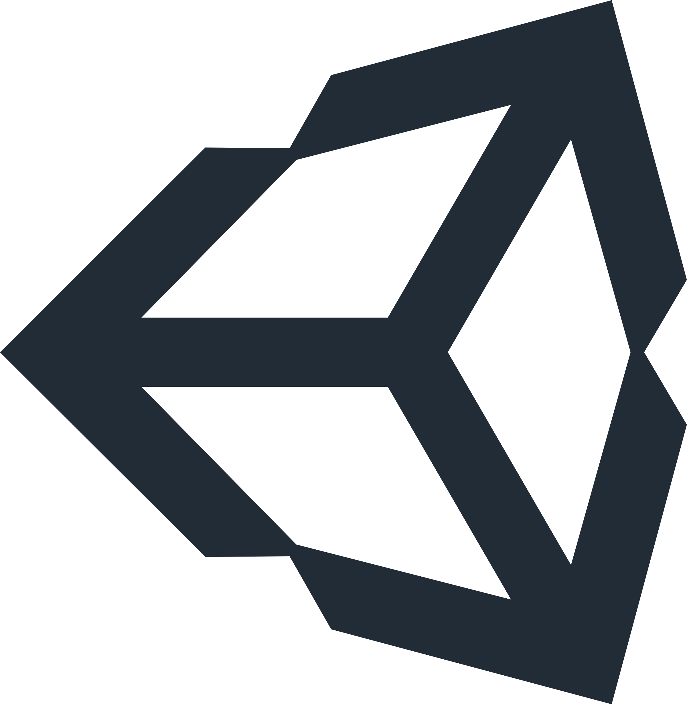

# <!--fit-->Introdução a programação de jogos

---
## Ementa da aula
- Ferramentas que serão utilizadas no curso.
- Diferenças entre game engines.
- Entender a base da programação orientada a objetos em jogos.
- Similaridades entre desenvolvimento de jogos e desenvolvimento BackEnd.
---

# Ferramentas do curso
* **Godot** para game engine
* **PlantUML** para visualização de gráficos (opcional)
* Aulas e códigos **disponiveis** em: 
## <!--fit--> **https://github.com/thiago-o-dev/gamedev-uni-resources**
* (me sigam lá)

---

# <!--fit-->Diferenças entre game engines
## (Unity x Unreal  x Godot)

---

# Unity 
* A mais famosa e mais utilizada profissionalmente.
* Utiliza **C#**  para programar.
* Tem foco em desenvolvimento 3D mas faz muito bem 2D.
* Sistema de precificação baseado no numero de vendas do jogo/aplicação.
* Usada tambem para controlar robôs.

---

# Unreal
*

---

# Godot
*

---

# <!--fit-->Entendendo a base do POO em jogos
## (Herança e componentização)

---

## Porque jogos usam Programação orientada a objetos?

É uma forma mais facil de interpretar um jogo, que normalmente terá muitas entidades junto de seus atributos.

* entidades: **(personagens, mapas, construções, etc...)**
* atributos: **(cor do modelo, vida, velocidade, etc)**

---

## Visto isso, entidades tem atributos.

# Mas um atributo **pode ser** uma entidade?

---

## Sim, isso é a ideia de componentização.

## Ao invés de seguirmos com o que a herança faz, recebendo todos os atributos de uma classe e se tornando filha da mesma, 
## **na componentização colocamos uma entidade como atributo**.

---

# Quando isso é usado?

* É o principal conceito necessário para o isolamento de código de um jogo.
Sem a componentização, se torna quase impossivel criar sistemas complexos.

* Eu deveria então sempre usar a componentização?
Cetos momentos será mais util usar os conceitos de herança e abstração, o objetivo é sempre pegar o caminho mais facil.

---

# <!--fit-->Vamos ver **na prática**.