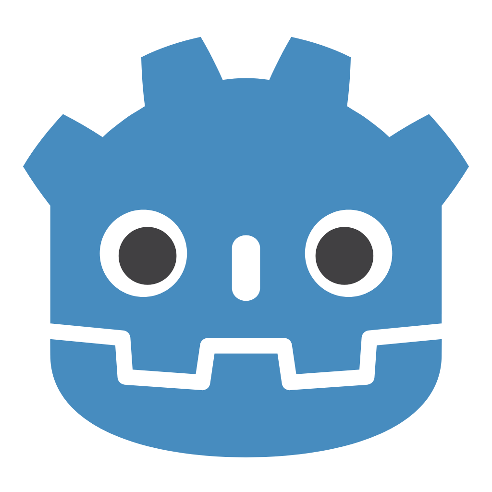

# <!--fit-->Introdução a programação de jogos

---
## Ementa da aula
- Ferramentas que serão utilizadas no curso.
- Diferenças entre game engines.
- Entender a base da programação orientada a objetos em jogos.
- Similaridades entre desenvolvimento de jogos e desenvolvimento BackEnd.
---

# Ferramentas do curso
* **Godot** para game engine
* **PlantUML** para visualização de gráficos (opcional)

---
# Aulas e códigos **disponiveis** no github: 
## <!--fit--> https://github.com/thiago-o-dev/courses
* (me sigam lá)
# Site buildado:
## <!--fit--> https://thiago-o-dev.github.io/courses/

---

# <!--fit-->Diferenças entre game engines
## (Unity x Unreal  x Godot)

---

# Unity 
* ## A **mais famosa e mais utilizada profissionalmente**.
* ## Utiliza **C#**  para programar.
* ## Tem **foco** em desenvolvimento 3D mas faz muito bem 2D.
* ## Sistema de precificação baseado no numero de vendas do jogo/aplicação.
* ## Usada tambem para controlar robôs (bem doido).

###### Subway Surfers, Pokémon GO, Hollow Knight, Among Us, Fall Guys, Cuphead, Untitled Goose Game, Subnautica, Ultrakill...
---

# Unreal
* ## Graficos estupidos de bons.
* ## Ótimo sistema de programação no code.
* ## Precificação de **5%** nos **lucros** após 1 milhão
* ## Editor pesado **pra caralho**.
###### Fortnite, Hogwarts Legacy, Final Fantasy VII Remake, Batman: Arkham Knight, PUBG, Rocket League, Black Myth: Wukong, Gears of War...
---

# Godot
* ## Iniciativa **FOSS**, sempre será gratuito.
* ## Desenvolvimento 2D muito simples.
* ## Melhorou muito no 3D, mas **ainda não** tem jogos AAA.
* ## Leve, roda em **quase** tudo (não tem suporte para consoles).
* ## É a game engine para **indies**.
###### Buckshot Roulette, Cassete Beasts, Brotato, Dog Walk (jogo do blender), Slay the Spire 2, Dome Keeper, Endoparasitic, EX-Zodiac, Gourdlets, Sonic Colors Ultimate...
---

# <!--fit-->Algum é melhor que o outro?

---

## <!--fit-->São **ferramentas**, cada uma vai facilitar **um processo diferente**.
* ## **Unity** tem um asset store estupido de grande.
* ## **Unreal** tem shaders incriveis e ótimos gráficos.
* ## **Godot** é ótimo para projetos 2D e código leve.

---

## <!--fit-->Escolha com base no **seu problema** e **suas capacidades**.

---

# <!--fit-->Entendendo a base do **POO** em jogos
## (Herança e componentização)

---

# <!--fit-->**Por que** jogos usam Programação orientada a objetos?

## É uma forma mais facil de interpretar um jogo, que normalmente terá muitas entidades junto de seus atributos.

* ## entidades: **(personagens, mapas, construções, etc...)**
* ## atributos: **(cor do modelo, vida, velocidade, etc)**

---

## Visto isso, entidades tem atributos.

# <!--fit-->Mas um atributo **pode ser** uma entidade?

---

## <!--fit-->Sim, **isso é a ideia de componentização**.

## Ao invés de seguirmos com o que a herança faz, recebendo todos os atributos de uma classe e se tornando filha da mesma, na componentização colocamos **"uma entidade" como atributo**.

---

# Quando isso é usado?

* ## É o principal conceito necessário para o isolamento de código de um jogo.  **Sem a componentização, se torna quase impossivel criar sistemas complexos a longo prazo**.

* ## Eu deveria então sempre usar a componentização? Certos momentos será mais util usar os conceitos de herança e abstração, o objetivo é **sempre pegar o caminho mais facil**.

---

# <!--fit-->Vamos ver **na prática**.